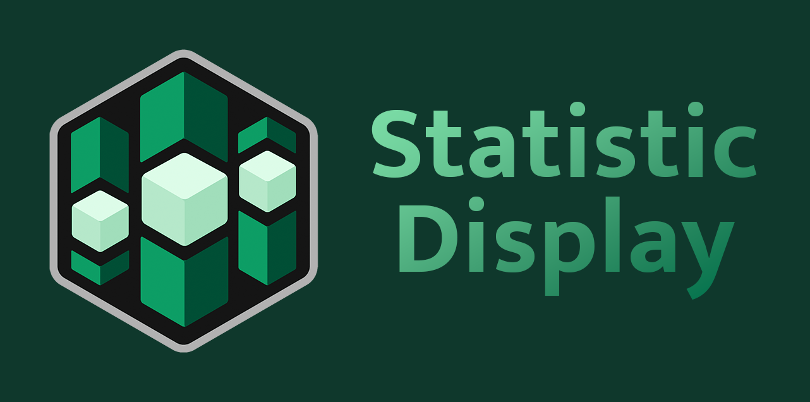

[-brightgreen)](https://feedback.minecraft.net/hc/en-us/sections/360001186971-Release-Changelogs)

# Statistic Display

This is an addon for Minecraft Bedrock Edition that easily displays statistics on the scoreboard. All statistics are tracked even when not on display and can be displayed with a single command. It is designed to be easy to add new statistics to and only uses one scoreboard objective!

Supported statistics:

- **Player Deaths**
- **Time Since Last Death**
- **Blocks Mined** (including each type of block)
- **Blocks Placed** (including each type of block)
- **Tools Broken** (including each type of tool)
- **Items Used** (including each type of item)
- **Interacted with Block or Entity** (including each type of block and entity)
- **Effects Gained** (including each type of effect)
- **Entities Killed** (including each type of entity)
- **Killed By Entity** (including each type of entity)
- **Damage Dealt**
- **Damage Taken** (including each type of damage)
- **Dimension Changes** (including each type of dimension)
- **Player Joins**
- **Highest Xp Level**
- **Longest Session**
- **Chats Sent**
- **Emotes Performed**
- **Other**
  - World Initialized
  - Most Players Online
  - Longest Inactivity
  - TNT Exploded

> [!IMPORTANT]
> This addon is a **Canopy Extension**, which means **Canopy** must be installed in your world for it to work.

**Canopy** can be downloaded here from its [GitHub Repo here](https://github.com/ForestOfLight/Canopy).

## Usage

All commands are prefixed with `./`. The `./stat` command is disabled until enabled with the `commandStat` rule. Do `./help` for more information.

**Usage: `./stat list`**  
Displays a list of all available statistics.

**Usage: `./stat <statistic>`**  
Displays the specified statistic on the scoreboard.

**Usage: `./stat <statistic/all> reset`**  
Resets the counts for the specified statistic, or all statistics.

**Usage: `./stat hide`**  
Hides the scoreboard.

**Usage: `./stat <statistic> print [player]`**  
Prints the top 15 players for the specified statistic, or for only the specified player.

**Usage: `./stat carousel <start/stop>`**  
Starts or stops the carousel of statistics.

**Usage: `./stat carousel <add/remove> <statistic>`**  
Adds or removes a statistic from the carousel.

**Usage: `./stat carousel list`**  
Lists all statistics in the carousel.

**Usage: `./stat carousel interval [seconds]`**  
Sets the interval for the carousel to change statistics.

**Usage: `./stat toggle [total/offline]`**  
Toggles whether the total or offline players should be shown.

**Usage: `./transferstats`**  
A utility command used to transfer statistics from v1.0.0 of this addon to v1.1.0. This command is only present in v1.1.0 & v1.1.1, and is removed in future versions.

---

### Special Thanks to CommandLeo

For their Java Edition version of the [Statistic Display](https://github.com/CommandLeo/scarpet/wiki/Statistic-Display) (as an scarpet app), which inspired me to create this **Canopy** extension addon.
